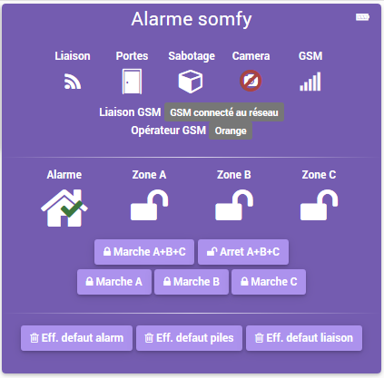
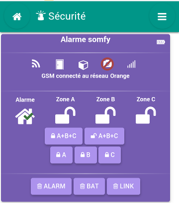
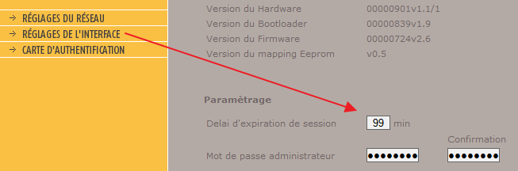
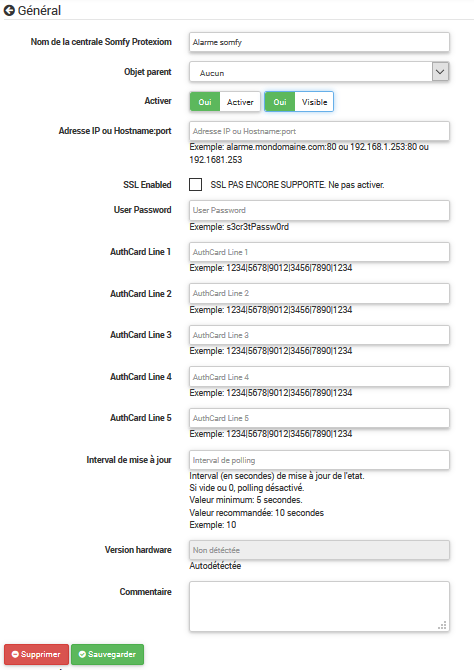

# Plugin Alarme Somfy

## Description

Ce plugin permet de contrôler une alarme Somfy Protexiom via son interface web.

A ce jour la solution permet de :

* Connaître l'état de l'alarme (etat des zones, et alerte)
* Piloter l'alarme (choix des zones à activer ou arrêt total).
* Récupérer les status de l'alarme  (intrusion, sabotage, état des piles, défaut de liaison avec un détecteur, signal gsm si présent, porte ouverte, présence camera)
* Reseter es defauts de l'alarme

## Installation / Paramétrage

### Paramétrage de l'alarme (Timeout)

Il est conseillé d'augmenter le timout de l'alarme a sa valeur maximum.

Connecter vous à l'alarme en mode Administrateur puis dans les réglages de l'interface, régler le délais d'expiration de la session.

 
### Installation / configuration

Une fois le plugin installé via le market, l'ensemble du paramétrage se fait depuis l'administration, comme n'importe quel plugin.
Les champs sont tous documentés sur la page de paramétrage, et la validité des paramêtres est vérifiée avant l'enregistrement.

**NOTE:** le dernier paramètre, *Version hardware*, est détécté automatiquement lors de la sauvegarde du plugin.
Il est affiché sur la page de paramétrage, car il peut être nécéssaire de le communiquer sur leforum en cas de bug

## Les limites de la solution

### Versions d'alarme compatible

Pour une même version de l'alarme (Protexiom 600), il existe différentes versions de materiel et de firmware. Somfy ne permet pas de faire des mises à jour de firmware.

Somfy ne propose pas d'API, le device virtuel execute donc les pages webs comme on le ferait via un browser. Selon les versions de firmware, certaines pages sont différentes.

La solution supporte actuellement 4 version différente, aussi bien dans la gamme *protexiom* que *protexial*. Si la votre n'est pas compatible, informez le link:view-source:https://forum.jeedom.fr/memberlist.php?mode=viewprofile&u=366[développeur] afin de voir s'il est possible de l'intégrer. C'est probable, les différences étants marginales.

### Session unique

L'ouverture d'une session sur l'alarme est lente, et log une entrée dans son journal d’événement sur certaines versions. Afin de ne pas surcharger l'alarme, et d'avoir un plugin réactif, la session est maintenue ouverte par le plugin. L'alarme ne permet qu'une seule session active à la fois. Cela signifie que lorsque le device virtuel est connecté, vous ne pouvez pas vous connecter à l'alarme (par exemple pour consulter sont journal d’événement ou la paramétrer).

Si vous souhaitez vous connecter sur l'alarme, il vous faudra donc désactiver temporairement le plugin.

### Timeout de session

La session de l'alarme a une durée de vie limitée. Même avec des interrogation régulière, la session est interrompue au bout du timeout.

L'interface d'amin de votre alarme permet de régler ce timeout. Je vous conseil de le régler au maximum (soit 99 minutes). Lors du timeout, le plugin gérera automatiquement la reconnexion.

Ce fonctionnement sera donc totalement transparent, si ce n'est l’apparition des logs de connexion dans le journal d’événement de l'alarme.

### Surconsommation de piles

L'activation du polling sur l'alarme l'empèche de se mettre en veille et augmente significativment la consommation de piles, qui passe alors d'environ 2 ans par jeu de piles, à environ 6 mois par jeu de piles. 3 options sont possibles:

* Changer de piles tous les 6 mois

* Changer la fréquence de polling dans la configuration globale du plugin, et l'augmenter à une valeur de 1 heure ou plus. La mise en veille se fera. La possibilité d'activer ou de désactiver l'alarme de manière très réactive reste disponible, mais la mise à jour en quasi temps réèl de l’état des détecteurs d'ouverture, ainsi que des status de l'alarme est perdue (de même que la possibilité de déclencher en temps réèl des scénarios sur ce type d'évènements). Selon l'usage fais du plugin, ça peut être acceptable.

* Bricoler un peu pour remplacer les piles par un powerbank. Un très bon exemple est documenté ici: https://www.jeedom.com/forum/viewtopic.php?f=28&t=2866&start=500#p378945 Dans ce cas, plus de problème de piles. Par contre, en cas de coupure de courant, l'autonomie passe de plusieurs jours avec les piles à une 10aine d'heure avec le powerbank. A chacun de juger si c'est acceptable.

### FAQ
#### Ou obtenir de l'aide sur l'utilisation de ce plugin ?

Poser votre question sur le topic [Plugin alarme protexiom](https://forum.jeedom.fr/viewtopic.php?f=28&t=2866) du forum jeedom, et soyez patient.

### Roadmap
* Récupération des logs de l'alarme
* Création d'un panel

### Changelog
[https://github.com/fdp1nm/plugin-protexiom/releases](https://github.com/fdp1nm/plugin-protexiom/releases)